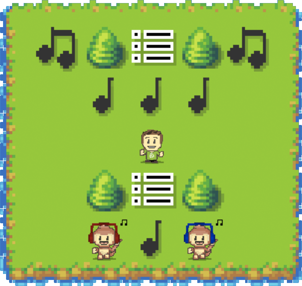
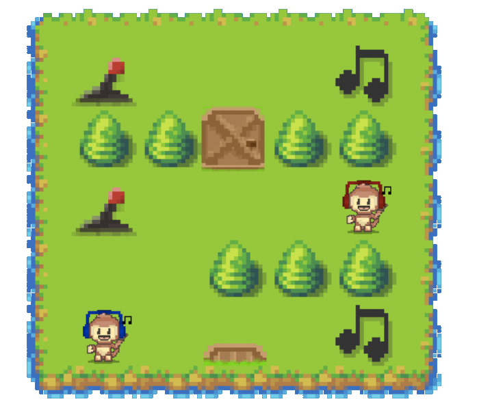

# Monkey Music: Core

Game engine for (Monkey Music Challenge)[http://monkeymusicchallenge.com].

## Introduction

Monkey Music Challenge is an AI- and pathfinding programming competition, where
monkeys battle it out in a virtual 2D-djungle over who can collect the most
songs, albums and playlists.

Your mission is to write a program to control a monkey. You win by scoring the
most points. Read on to find out more...

## How to play

Your the game takes place in a virtual 2D-world, looking something like this:

Your program reads this 2D-world from a JSON object, which in the above case
would look like this:

~~~json
{
  "layout": [
    ["album", "wall", "playlist", "wall", "album"],
    ["empty", "song", "song", "song", "empty"],
    ["empty", "empty", "user", "empty", "empty"],
    ["empty", "wall", "playlist", "wall", "empty"],
    ["empty", "monkey", "song", "monokey", "empty"]
  ],
  "remainingTurns": 10,
  "isGameOver": false,

  "score": 0,
  "position": [4, 1],
  "inventory": [],
  "inventorySize": 3,
  "buffs": {}
}
~~~

The game is turn based. At the start of every turn, your program
receives a new JSON object with the current state of the 2D-world.

At the end of every turn, your program sends a JSON command telling your
monkey what to do next. The computation time during each turn is limited, use
it wisely.

## Commands

You control your monkey by sending one of three different commands: `move`, for
moving around the level `use`, for using items in your inventory and `idle` for
doing nothing at all. 

### Move

The following are valid move commands:

~~~json
{"command": "move", "direction": "left"}
{"command": "move", "direction": "right"}
{"command": "move", "direction": "up"}
{"command": "move", "direction": "down"}
~~~

The `move` command both moves your monkey around the world, and lets it
interact with its surroundings.

For example, in this scenario:

~~~json
{
  "layout": [["monkey", "empty"]],
  "position": [0, 0]
}
~~~

issuing the command:

~~~json
{"command": "move", "direction": "right"}
~~~

would result in your monkey moving one step to the right, as such:

~~~json
{
  "layout": [["empty", "monkey"]],
  "position": [0, 1]
}
~~~

#### Picking up items

Your monkey can pick up items by moving to them.

For example, in this scenario:

~~~json
{
  "layout": [["monkey", "song"]],
  "position": [0, 0],
  "inventory": []
}
~~~

issuing the command:

~~~json
{"command": "move", "direction": "right"}
~~~

would result in your monkey picking up the `song` to its right, as such.

~~~json
{
  "layout": [["monkey", "empty"]],
  "position": [0, 0],
  "inventory": ["song"]
}
~~~

Note that when picking up an item, your `monkey` remains at its current
position.

Items can only be picked up while your monkey's inventory is smaller than the
`inventorySize` specified in the game state. If the inventory is full

#### Dropping off music items

You score points by collecting `song`s, `album`s and `playlist`s. Your monkey
must first pick them up, then carry them in its inventory to the nearest
`user`. The `user` will reward your `monkey` for any collected music with points.

The `user` rewards the following points for different music items:

* `song`: 1 point
* `album`: 2 points
* `playlist`: 4 points

For example, in this scenario:

~~~json
{
  "layout": [["monkey", "user"]],
  "position": [0, 0],
  "inventory": ["song", "album", "playlist"],
  "score": 0
}
~~~

issuing the command:

~~~json
{"command": "move", "direction": "right"}
~~~

would result in your monkey trading in all currently carried music items for
points, as such:

~~~json
{
  "layout": [["monkey", "user"]],
  "position": [0, 0],
  "inventory": [],
  "score": 7
}
~~~

#### Tackling other monkeys

If another `monkey` is in your way, you can tackle it! A tackled monkey will be
unable to do anything else for the remainder of the turn, and you also have a
50% chance of stealing something from your opponent's inventory. Watch out for
thieves!

For example, in this scenario, where your opponent's monkey stands at position `[0, 2]`:

~~~json
{
  "layout": [["monkey", "monkey", "empty"]],
  "position": [0, 0],
  "inventory": []
}
~~~

issuing the command:

~~~json
{"command": "move", "direction": "right"}
~~~

would (if you get to move before your opponent) result in your monkey tackling
its opponent, and also (possibly) stealing one of its items, as such:

~~~json
{
  "layout": [["empty", "monkey", "monkey"]],
  "position": [0, 1],
  "inventory": ["album"]
}
~~~

#### Move order

You and your opponent might try to tackle each other during the same turn. The
`monkey` that gets to move first is decided by random chance, but if your
program replied faster than your opponent's program, your `monkey` will have a
(slightly) greater chance of moving first!

#### Opening doors

The world is full of `open-door`s and `closed-door`s. They are controlled
through interacting with `lever`s.

For example, in the following scenario:

~~~json
{
  "layout": [["open-door", "lever"],
             ["closed-door", "monkey"]],
  "position": [1, 1]
}
~~~

issuing the command

~~~json
{"command": "move", "direction": "up"}
~~~

Would open all the `closed-door`s and close all the `open-door`s:

~~~json
{
  "layout": [["closed-door", "lever"],
             ["open-door", "monkey"]],
  "position": [1, 1]
}
~~~

#### Entering tunnels

Tunnels connect different parts of the world with each other. Every `tunnel`
has a number, such as `tunnel-1`, `tunnel-2` etc. There are always two of every
tunnel on every level, and my moving inside a tunnel, your monkey will pop up
at the other end.

For example, in the following scenario:

issuing the command:

~~~json
{"command": "move", "direction": "right"}
~~~

would give the following outcome:

~~~json
{"todo": "todo"}
~~~

### Use

Through the `use` command, your monkey can consume an item in its inventory.
There are 2 different types of items: `banana`s and `trap`s.

#### Bananas

Bananas give a positive `speedy` buff to your monkey.

By picking up a `banana` and then issuing the following command:

~~~json
{"command": "use", "item": "banana"}
~~~

your monkey will obtain a `speedy` buff for the 6 upcoming turns.

While your monkey is `speedy`, you can make multiple moves per turn by sending
`move` commands with an array of several directions, like this:

A maximum of 2 moves per turn is allowed while `speedy`. Remember to use the
`"directions"` argument instead of the singular `"direction"`!

~~~json
{"command": "move", "directions": ["left", "up"]}
~~~

#### Traps

Traps are offensive items, that mess up the lives of your opponents.

By picking up a `trap` and then issuing the following command:

~~~json
{"command": "use", "item": "trap"}
~~~

your monkey will set a trap at its current position. Armed traps are invisible, and will not show up in the layout. Don't worry, you cannot fall victim to your own traps.

When your opponent `move`s to the same position as your trap, it will be
stunned for 6 turns, also possibly losing an item in its inventory.

### Idle

For the situtations where you need to remain still and plot evil plans, the `idle` command is just what you need:

~~~json
{"command": "idle"}
~~~

## License

Copyright © 2014 Oscar Söderlund, Anton Lindgren.

Distributed under the MIT License.
